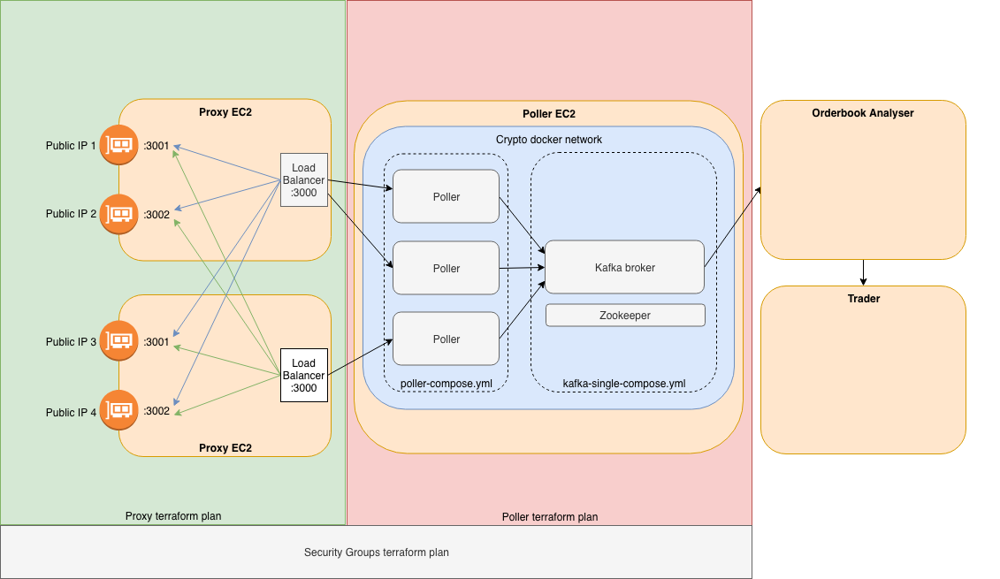

## Terraform

There are 3 terraform plans:
security_groups
proxy
poller (still WIP)

# security_groups
Builds security groups for proxy and poller roles

# proxy
Launches configurable number of proxy instances with 2 public IPs associated for each

# poller
Launches a poller instance and deploys kafka and zookeper and poller containers

## ☝ Prerequisites
AWS profile named "crypto" with keys set up in your local ~/aws/credentials
Eg:

```
[crypto]
aws_access_key_id=YOURKEY
aws_secret_access_key=YOURSECRET
```

## Usage

`brew install terraform`

Create:

`terraform init`

`terraform apply`

Review any changes:

`terraform plan`

Destroy:

`terraform destroy`